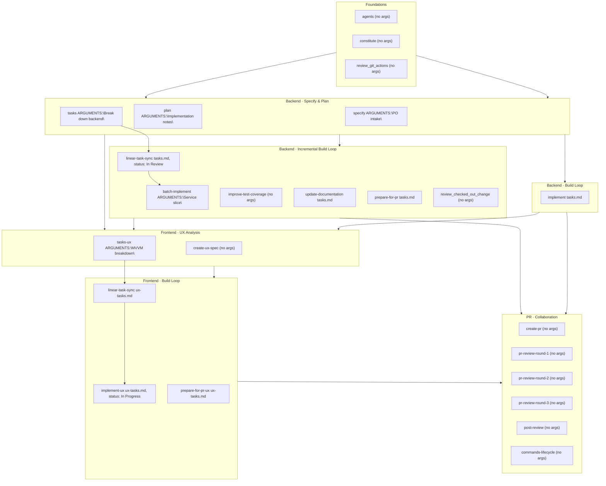

# Command Lifecycle Guide
Version: 2025-10-13.1

## Background
This is a guide to a new methodology to build systems - top to bottom, spec to implementation.
It's not new?! It is AI is doing most of the work and you are there to curate its context (spec) and direct to the right implementation.
This is why we have so many commands for different scenarios.
Feel free to extend the commands and templates, and then update this file by running `/commands-lifecycle` in Claude or `Follow commands-lifecycle.py workflow` in Codex.

## High-Level Approach
1. Template - provide a base file for generation of other files for a particular task or type of information e.g. specification in spec.md.
2. Command - a workflow to trigger a workflow (with or without template) that is orchestrated by AI.
3. Prompt - the trigger to initiate the workflow e.g. Follow command.md workflow with the following arguments ....
5. Context - artifacts that we generate as part of the process that focus on the e2e approach rather than the specific implementation (which can be generated as well)

You apply the `Prompt` to invoke a `Command` which may use a `Template` to create/update the `Context` that can be used by AI when solving different tasks (create other context, refactor or implement).
Remember to update `.specify/memory/prompt_history.md` with your prompts and look for opportunities to push more into commands and templates.

## Overview
This guide maps every command in `.claude/commands` to the Radar Service delivery
methodology. Use it to pick the right automation at each lifecycle stage and to
understand the minimal inputs each command expects.

## Command Directory
| Command | Purpose | Key inputs (examples) |
| --- | --- | --- |
| `agents` | Populate `AGENTS.md` with the current tech stack and structure. | — |
| `batch-implement` | Slice `tasks.md` into reviewer-friendly batches. | `ARGUMENTS="Focus on dc_registry_service"`; `tasks.md` |
| `constitute` | Author or refine the constitution baseline. | — |
| `create-pr` | Draft the pull request body with conventional commit formatting. | — |
| `commands-lifecycle` | (Meta) Instructions for maintaining this guide. | — |
| `create-ux-spec` | Produce `ux-spec.md` from user journeys and views. | — |
| `implement` | Execute backend `tasks.md` sequentially. | `tasks.md`; optionally `plan.md` context |
| `implement-ux` | Execute frontend `ux-tasks.md` sequentially. | `ux-tasks.md`; `tasks.md` for parity |
| `improve-test-coverage` | Investigate gaps and add focused tests. | — |
| `linear-task-sync` | Mirror `tasks.md` / `ux-tasks.md` into Linear with labels and status. | `tasks.md`; `ux-tasks.md` |
| `plan` | Generate the implementation plan and supporting artifacts. | `ARGUMENTS="Inventory lifecycle MVP"`; branch auto-detected |
| `post-review` | Publish a consolidated multi-round PR review. | — |
| `pr-review-round-1` | Capture the first-pass PR review notes. | — |
| `pr-review-round-2` | Refine the PR review after author updates. | — |
| `pr-review-round-3` | Deliver the final authoritative PR verdict. | — |
| `prepare-for-pr` | Run backend pre-flight (build, lint, tests, docs). | `tasks.md` |
| `prepare-for-pr-ux` | Run frontend pre-flight and coverage steps. | `ux-tasks.md`; `tasks.md` for backend parity |
| `review_checked_out_change` | Perform an offline review of local diffs. | — |
| `review_git_actions` | Audit GitHub workflows for security and quality. | — |
| `specify` | Create or update the feature specification. | `ARGUMENTS="Enable delivery intake audits"`; results in `spec.md` |
| `tasks` | Derive backend task list from the plan and contracts. | `ARGUMENTS="Backend MVP scope"`; outputs `tasks.md` |
| `tasks-ux` | Derive frontend MVVM tasks from UX assets. | `ARGUMENTS="DC dashboard"`; outputs `ux-tasks.md` |
| `update-documentation` | Synchronise docs with the latest implementation. | `tasks.md` |

## Lifecycle Map

## Stage Guidance
### Stage 0 · Foundations
- `commands_lifecycle` documents how to maintain this guide whenever commands evolve.
- `agents` records the canonical architecture snapshot before major work begins.
- `constitute` ensures principles are encoded prior to specification.
- `review_git_actions` is available whenever workflows change; run it early when CI
  artifacts are introduced.

### Stage 1 · Backend Specification & Planning
- `specify` captures the feature narrative and seeds the branch.
- `plan` applies the implementation template, generating `plan.md`, `research.md`,
  `data-model.md`, contracts, and progress telemetry.
- `tasks` produces a dependency-ordered backend backlog from the design artifacts.

### Stage 2 · Backend Implementation Loop
- `batch-implement` narrows `tasks.md` into reviewable slices if needed.
- `implement` executes tasks sequentially, while `improve-test-coverage` can be used
  whenever gaps are discovered.
- `linear-task-sync` keeps Linear issues aligned with `tasks.md` labels and status
  before/after each implementation batch.
- `update-documentation` keeps `README.md`, ADRs, and specs aligned.
- `prepare-for-pr` and `review_checked_out_change` run before publishing a backend PR.

### Stage 3 · Frontend UX Analysis & Execution
- `create-ux-spec` analyses journeys, personas, and views, producing `ux-spec.md`.
- `tasks-ux` converts UX assets into MVVM-friendly `ux-tasks.md`.
- `implement-ux` drives the frontend backlog, with `prepare-for-pr-ux` mirroring the
  backend pre-flight workflow.
- `linear-task-sync` mirrors `ux-tasks.md` progress into Linear so the wider team can
  track UI delivery alongside backend work.

### Stage 4 · Pull Request Review Lifecycle
- `create-pr` drafts the pull request once pre-flight checks succeed.
- `pr-review-round-1`, `pr-review-round-2`, and `pr-review-round-3` structure the
  reviewer feedback loops.
- `post-review` wraps the cycle by publishing the consolidated review.
- `update-documentation` and `improve-test-coverage` remain available post-merge for
  hardening iterations.
